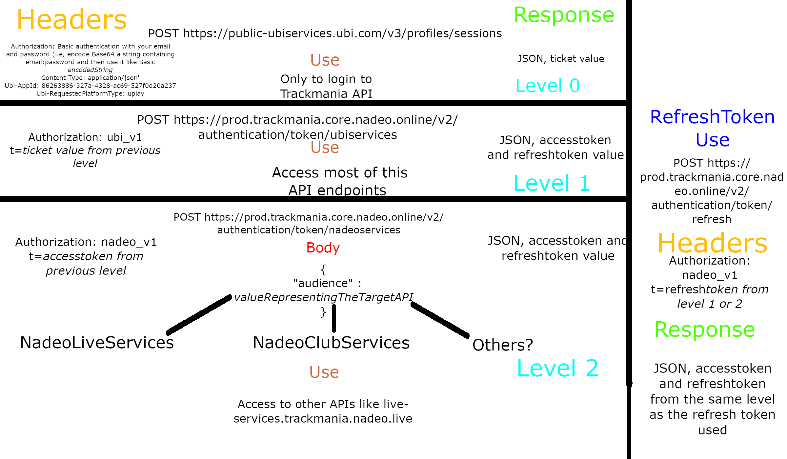

# Trackmania 2020 Unofficial API Documentation
This repository is a series of markdown files containing all the documentation myself and others found about Trackmania 2020 and the API calls the game makes to work.

## Progress

This is in a very begin phase so please pull request to help this project by fixing typos, fix errors, describe in more detail the use of the endpoints, helping in the structure of documentation, and most important add more information.

Any help is appreciated!

## TODO

* Finishing the documentation on the other API address (will be pushed until Sunday, 26/07/2020)

## General View

For the game to work, first we need to authenticate. The next picture ilustrates the process of login in the APIs and how the different tokens have different uses

As you can see, you only need to use the Login Level 0, 1 and 2 only one time, after that you only need to refresh the token from Level 1 and 2 without needing for Uplay login anymore.

The next image represent the APIs used and their uses:

***TODO Make Image with all the APIs address and their use***

## Specification

You can access in more detail what endpoints exist, the information needed to send and the response received in the next links:

[Prod Trackmania API](ProdTrackmania.md)

[Live Services API]()

[UbiServices]()

[msr-public and akamai.net]()

